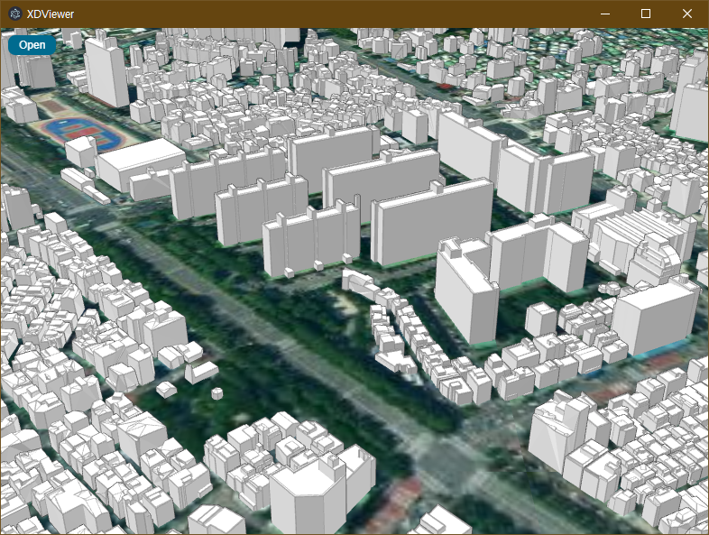

# XDViewer
데이터 시각화를 로컬에서 하기위한 일렉트론 기반의 프로젝트 입니다.
## 
### 1. Electron 메인 프로세스 (index.js)
- 브라우저 창 생성:
  - 창 크기, 메뉴 숨김, Node.js 및 컨텍스트 격리 설정.
  - preload.js를 활용하여 주고받는 이벤트 처리.
- DevTools 관리:
  - F12 키를 눌렀을 때 DevTools를 열고 닫는 로직을 추가.
  - DevTools 창 크기를 동적으로 조정.
- 파일 선택:
  - dialog.showOpenDialog를 이용하여 파일 열기 다이얼로그를 표시.
  - 선택한 파일 경로를 렌더러 프로세스에 전달.
- globalShortcut:
  - F12 단축키를 등록하여 이벤트 처리.
##
### 2. 렌더러 프로세스 (index.html)
- UI 디자인:
  - #map: 3D 맵을 렌더링할 컨테이너.
  - #interface: 파일 열기 및 동적으로 생성되는 레이어 관리 버튼.
- 버튼 동작:
  - "Open" 버튼 클릭 시 메인 프로세스와 통신하여 파일 경로를 요청.
  - 새로운 레이어를 추가하고, 해당 버튼을 동적으로 생성.
- 3D 타일 데이터 처리:
  - 파일 경로를 Module.JSLayerList와 연동하여 새로운 레이어로 로드.
  - 레이어 제거 시 대응하는 버튼도 함께 삭제.
- XDWorld 연동:
  - Module 객체를 통해 3D 타일, DEM 데이터 등을 처리.
  - window.onresize 이벤트로 화면 크기 변화에 동적 대응.
##
### 3. 테스트 환경
- 윈도우 
  - OS : 윈도우 10 Pro 22H2
  - Node.js : v20.18.1
  - npm : 10.8.2

- WSL 2.0 (1.0은 Gui를 지원하지 않음)
  - OS : Ubuntu-22.04 LTS
  - fusermount :  2.9.9
  - Node.js : v22.13.0
  - npm : 11.0.0

- 리눅스 
  - OS : Ubuntu-20.04 LTS
  - fusermount :  2.9.9
  - Node.js : v10.19.0
  - npm : 6.14.4

- Mac OS 
  - OS : 15.1.1
  - brew : v4.4.16
  - Node.js : v23.6.0
  - npm : 10.9.2
##
### 4. **빌드방법**
```shell
$ git clone https://github.com/XDBuilder/XDViewer.git
$ cd XDViewer.git
$ npm install
$ npm start
```

